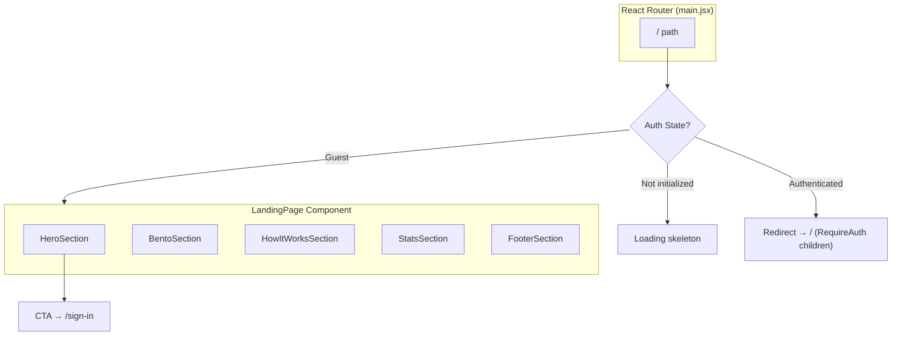

# Design Document: Landing Page

## Overview

The landing page is a static, publicly accessible marketing page rendered at the root route `/` for unauthenticated visitors. It communicates MeeTogether's value proposition — proving skills through shipped projects and peer reviews — and funnels visitors toward sign-up. Authenticated users bypass this page entirely, routing directly to the Home feed.

The page is entirely client-side with no backend data fetching requirements. It uses the existing dark theme, glassmorphism styling from the sign-in page, and integrates Lottie animations (with static fallbacks) for visual impact.

**Key Design Decisions:**
- Landing page renders outside the `App` layout shell (no Navbar/constrained main container) to allow full-bleed hero and custom layout
- Uses existing `GuestOnlyRoute` pattern but with a modified redirect target for authenticated users
- Lazy-loaded as a separate chunk to keep the authenticated app bundle lean
- Lottie animations are loaded asynchronously with static SVG/icon fallbacks

## Architecture



### Routing Strategy

The current router has the Home component at path `/` inside a `RequireAuth` wrapper. To support the landing page for guests, the design introduces a new `LandingRoute` wrapper at the `/` index that:

1. If `initialized === false` → renders a minimal loading state (no flash)
2. If `currentUser` exists → renders the existing `RequireAuth > Home` flow
3. If no `currentUser` → renders the `LandingPage` component

This is implemented as a new wrapper component (`LandingOrHome`) placed at the `/` index route, keeping the existing `RequireAuth` route group intact for all other authenticated routes.

**Alternative considered:** Putting the landing page under `GuestOnlyRoute` — rejected because `GuestOnlyRoute` currently redirects authenticated users back to `/`, which would create a redirect loop. Modifying it risks breaking the sign-in/sign-up flow.

## Components and Interfaces

### File Structure

```
client/src/components/Landing/
├── LandingPage.jsx            # Main page container, section orchestrator
├── LandingOrHome.jsx          # Route-level auth switch component
├── HeroSection.jsx            # Full-viewport hero with headline + CTA
├── BentoSection.jsx           # 3-card value proposition grid
├── HowItWorksSection.jsx      # Step-by-step flow explanation
├── StatsSection.jsx           # Community metrics display
├── FooterSection.jsx          # Site footer with links
├── GlassCard.jsx              # Reusable glassmorphism card primitive
└── LottieAnimation.jsx        # Lottie wrapper with fallback handling

client/src/assets/animations/
├── student-task.json          # Student card animation
├── mentor-review.json         # Mentor card animation
└── recruiter-dashboard.json   # Recruiter card animation
```

### Component Interfaces

#### LandingOrHome
```jsx
// Route-level component — no props
// Reads auth state from Redux, conditionally renders LandingPage or Home
// Placed at the "/" index route in the router config
```

#### LandingPage
```jsx
// No props — self-contained static page
// Renders outside App's <main> constraints via its own full-width layout
// Uses semantic HTML: <header>, <main>, <section>, <footer>
```

#### HeroSection
```jsx
// Props: none (static content)
// Renders: full-viewport section with h1, sub-headline, CTA button
// CTA navigates to /sign-in via react-router Link
```

#### BentoSection
```jsx
// Props: none (static content)
// Renders: responsive grid of 3 GlassCard components
// Each card contains role-specific content + LottieAnimation
```

#### GlassCard
```jsx
/**
 * @param {object} props
 * @param {string} props.title - Card heading
 * @param {React.ReactNode} props.children - Card body content
 * @param {string} [props.className] - Additional CSS classes
 */
```

#### LottieAnimation
```jsx
/**
 * @param {string} props.animationPath - Path to Lottie JSON (dynamic import)
 * @param {React.ReactNode} props.fallback - Static fallback element (icon/SVG)
 * @param {string} [props.className] - Container styling
 * @param {boolean} [props.loop=true] - Loop animation
 * @param {string} props.ariaLabel - Accessible label for the animation
 */
```

#### HowItWorksSection
```jsx
// Props: none (static content)
// Renders: ordered steps with icons and connecting visual elements
```

#### StatsSection
```jsx
// Props: none (static content — hardcoded initial values)
// Renders: 3+ metric cards in glassmorphism style
```

#### FooterSection
```jsx
// Props: none (static content)
// Renders: logo, tagline, link groups, sign-in/sign-up links
```

### Routing Integration Detail

Current `main.jsx` router change:

```jsx
// Add lazy import
const LandingPage = lazy(() => import('./components/Landing/LandingPage.jsx'))
const LandingOrHome = lazy(() => import('./components/Landing/LandingOrHome.jsx'))

// Modify the "/" index route:
// Before: "/" is inside RequireAuth children only
// After: "/" uses LandingOrHome which internally decides
{
  path: '/',
  element: <App />,
  children: [
    // New: index route with auth-switching logic
    {
      index: true,
      element: withSuspense(
        <LandingOrHome />,
        'Loading',
        'Preparing your experience.',
      ),
    },
    // Existing GuestOnlyRoute children (sign-in, sign-up)...
    // Existing RequireAuth children (minus "/" which is now handled above)...
  ]
}
```

The `LandingOrHome` component:
```jsx
const LandingOrHome = () => {
  const { currentUser, initialized } = useSelector(state => state.auth);

  if (!initialized) return null; // or minimal skeleton

  if (currentUser) {
    if (!currentUser.emailVerified) {
      return <Navigate to="/verify-email" replace />;
    }
    return <Home />;
  }

  return <LandingPage />;
};
```

**Note:** The `App.jsx` layout applies Navbar and constrained `<main>` to all children. The landing page needs full-bleed layout. To handle this, `LandingPage` will render with negative margins / absolute positioning to break out of the constrained container, OR the `App` component will conditionally hide the Navbar and remove the max-width constraint when the landing page is active. The cleaner approach: `App.jsx` checks if the current path is `/` and `currentUser` is null to conditionally render a minimal shell (no Navbar, no padding).

## Data Models

This feature is entirely static with no backend interaction. All content is hardcoded in components.

### Static Content Structure

```typescript
// Conceptual types for content (implemented as JSX, not fetched)

interface HeroContent {
  headline: string;        // "Stop talking, start showing"
  subHeadline: string;     // "Prove your skills through..."
  ctaText: string;         // "Join Now"
  ctaRoute: string;        // "/sign-in"
}

interface BentoCard {
  id: 'student' | 'mentor' | 'recruiter';
  title: string;
  description: string;
  animationPath: string;   // path to Lottie JSON
  fallbackIcon: string;    // lucide-react icon name
}

interface Step {
  number: number;
  label: string;
  icon: string;            // lucide-react icon name
}

interface StatMetric {
  value: string;           // "500+" formatted
  label: string;           // "Active Builders"
}

interface FooterLinkGroup {
  title: string;           // "Product", "Company", "Legal"
  links: { label: string; href: string }[];
}
```

### Redux State (Read-Only)

The landing page only reads from the existing auth slice:
```typescript
interface AuthState {
  currentUser: User | null;
  initialized: boolean;
  // ... other fields not used by landing page
}
```

No new Redux slices, actions, or API calls are needed.


## Correctness Properties

*A property is a characteristic or behavior that should hold true across all valid executions of a system-essentially, a formal statement about what the system should do. Properties serve as the bridge between human-readable specifications and machine-verifiable correctness guarantees.*

### Property 1: Auth-gated route consistency

*For any* auth state transition where `initialized` is true, the root route `/` shall render the LandingPage component if and only if `currentUser` is null, and shall render the Home component if and only if `currentUser` is non-null and email-verified.

**Validates: Requirements 1.1, 1.2**

Note: This feature is primarily static UI rendering and simple conditional routing. The single property above captures the only meaningful logical invariant. All other requirements (visual design, responsive layout, accessibility, content display) are verified through example-based unit tests and visual/integration tests rather than property-based testing, as they involve CSS-driven behavior and hardcoded content with no meaningful input variation.

## Error Handling

### Animation Loading Failures

| Scenario | Handling |
|----------|----------|
| Lottie JSON fails to load (network error, 404) | `LottieAnimation` catches the dynamic import rejection and renders the `fallback` prop (static icon/SVG) |
| Lottie JSON is malformed | `lottie-react` silently fails; the `LottieAnimation` wrapper detects missing render via `onError` and shows fallback |
| `lottie-react` package itself fails to load | The entire `LottieAnimation` component is wrapped in an error boundary that renders fallback content |

### Implementation Pattern

```jsx
// LottieAnimation.jsx error handling approach
const LottieAnimation = ({ animationPath, fallback, ariaLabel, ...props }) => {
  const [animationData, setAnimationData] = useState(null);
  const [hasError, setHasError] = useState(false);

  useEffect(() => {
    let cancelled = false;
    import(/* @vite-ignore */ animationPath)
      .then(mod => { if (!cancelled) setAnimationData(mod.default); })
      .catch(() => { if (!cancelled) setHasError(true); });
    return () => { cancelled = true; };
  }, [animationPath]);

  if (hasError || !animationData) {
    return <div aria-label={ariaLabel}>{fallback}</div>;
  }

  return (
    <div aria-label={ariaLabel} role="img">
      <Lottie animationData={animationData} loop={props.loop ?? true} />
    </div>
  );
};
```

### Auth State Edge Cases

| Scenario | Handling |
|----------|----------|
| `initialized === false` (session restoring) | `LandingOrHome` renders `null` (nothing), preventing content flash. `AuthBootstrap` handles session restore. |
| `currentUser` exists but `emailVerified` is false | Redirect to `/verify-email` (consistent with existing `RequireAuth` behavior) |
| Auth state changes mid-view (e.g., token expires) | Redux state update triggers re-render; `LandingOrHome` reactively shows landing page |

### Layout and Responsive Failures

- All layout uses CSS Grid/Flexbox with Tailwind — no JS-based layout calculations that could error
- Images/animations have explicit aspect ratios to prevent layout shift
- `min-h-screen` on hero ensures viewport coverage even with empty content

## Testing Strategy

### Why Property-Based Testing Does Not Apply

This feature consists entirely of:
- **Static UI rendering** — React components that display hardcoded content
- **Simple conditional routing** — a single boolean check (authenticated vs. guest)
- **CSS-driven responsive behavior** — Tailwind classes, not programmatic logic

There are no data transformations, parsers, serializers, algorithms, or business logic functions that would benefit from property-based testing. The input space is effectively two states (authenticated / not authenticated) rather than a wide or infinite domain. Example-based tests and integration tests are the appropriate strategy.

### Unit Tests (Example-Based)

| Test | What it validates | Requirement |
|------|-------------------|-------------|
| `LandingOrHome` renders `LandingPage` when `currentUser` is null | Auth gating for guests | 1.1 |
| `LandingOrHome` renders `Home` when `currentUser` exists and verified | Auth gating for users | 1.2 |
| `LandingOrHome` renders nothing when `initialized` is false | No content flash during bootstrap | 1.3 |
| CTA button links to `/sign-in` | Navigation behavior | 1.4 |
| `HeroSection` renders an h1 element | Semantic HTML | 2.6 |
| CTA button has min 44x44px touch target | Accessibility | 2.5 |
| `BentoSection` renders exactly 3 cards | Correct card count | 3.1 |
| `LottieAnimation` shows fallback on load error | Graceful degradation | 9.3 |
| `LandingPage` uses semantic elements (header, main, section, footer) | Accessibility structure | 10.1 |
| Footer contains sign-in and sign-up links | Navigation completeness | 7.3 |

### Integration / Visual Tests

| Test | What it validates | Requirement |
|------|-------------------|-------------|
| Landing page is lazy-loaded (separate chunk in build) | Bundle splitting | 9.1 |
| Bento cards stack vertically at < 768px viewport | Responsive layout | 3.5, 8.2 |
| Bento cards use grid at ≥ 768px viewport | Responsive layout | 3.6, 8.3 |
| No horizontal scrollbar at 320px viewport width | Responsive bounds | 8.4 |
| All interactive elements are keyboard-focusable | Accessibility | 10.2 |
| Text contrast ratios meet WCAG AA thresholds | Accessibility | 10.4 |

### Testing Tools

- **Vitest** + **React Testing Library** for unit/component tests
- **jsdom** environment for rendering tests
- Manual verification with Chrome DevTools for responsive and contrast checks
- **Note:** Full WCAG compliance requires manual testing with assistive technologies and expert accessibility review

### Performance Verification

- Run `vite build` and verify the landing page chunk is separate from the main app bundle
- Verify hero section content (headline, CTA) renders without waiting for Lottie animations
- Check Lighthouse performance score as a manual gate
