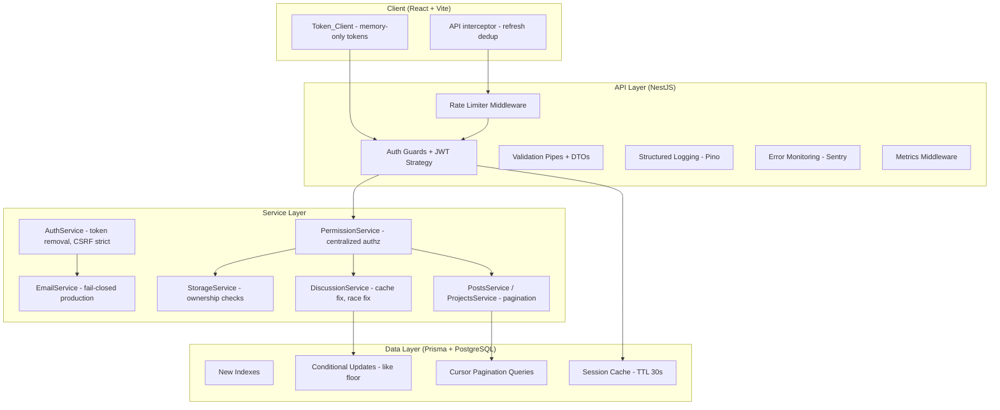

# Design Document: Production Hardening

## Overview

This design covers the systematic production hardening of MeeTogether — a build-first tech network for students and early engineers — to prepare for a 10,000-user public launch. The work addresses 26 requirements spanning security, correctness, scalability, authorization, observability, and operations.

The implementation is organized into priority groups for incremental delivery. Each group is independently deployable and testable, allowing the team to ship critical security fixes first while building out scalability and observability in parallel.

**Key design decisions:**
- Memory-only access token storage to eliminate XSS credential theft vectors
- Cursor-based pagination (not offset) for stable results under concurrent writes
- A centralized `PermissionService` to avoid scattered inline auth checks
- Pino for structured logging (already a dependency) with Sentry for error alerting
- Exponential-backoff Redis reconnection to prevent permanent degraded-mode drift

## Architecture

The production-hardening changes touch four layers of the existing architecture:



### Priority Group Execution Order

| Group | Focus | Requirements |
|-------|-------|-------------|
| P0 - Critical Security | Token leakage, CSRF, token storage | 1, 3, 5 |
| P1 - Authorization & Bugs | Ownership, like floor, cache leak, race condition | 2, 8, 9, 10 |
| P2 - Resilience | Rate limiter fixes, Redis reconnection, email enforcement | 6, 7, 12, 15 |
| P3 - Scalability | Indexes, pagination, per-request overhead | 4, 11, 14, 17, 18 |
| P4 - Authorization Model | Permission service, issues/deployments auth, comments | 16, 19, 20 |
| P5 - Observability | Logging, error monitoring, metrics | 21, 22, 23 |
| P6 - Operations & Quality | Env validation, staging, CI, lint | 13, 24, 25, 26 |


## Components and Interfaces

### 1. AuthService Changes (Requirements 1, 5)

**Token Removal:**
- Remove `buildTokenPreview()` calls from `signup()`, `resendVerification()`, and `forgotPassword()` response objects
- Delete the `buildTokenPreview()` method entirely
- Add a debug-only controller endpoint `GET /auth/debug/last-token` gated by `DEBUG_TOKEN_INSPECT` env var
- Register this endpoint only when `NODE_ENV !== 'production'`

**CSRF Strict Mode:**
- Modify `validateCsrfForSession()` to reject when `sessionCsrfTokenHash` is `null` or `undefined`
- Replace the early `return` on null hash with `throw new UnauthorizedException('Session requires re-authentication')`

```typescript
// Before (current):
private validateCsrfForSession(req, sessionCsrfTokenHash?: string | null) {
  if (!sessionCsrfTokenHash) return; // BUG: skips validation for legacy sessions
  ...
}

// After:
private validateCsrfForSession(req, sessionCsrfTokenHash?: string | null) {
  if (!sessionCsrfTokenHash) {
    throw new UnauthorizedException('Session expired — please log in again');
  }
  ...
}
```

### 2. StorageService Ownership Validation (Requirement 2)

**New dependency:** Inject `PrismaService` into `StorageService`.

**Changes to `createUploadTarget()`:**
- Before building the storage key, validate ownership based on `entityType`:
  - `project_cover` + `entityId`: query `Project` where `id = entityId AND ownerUserId = user.sub`
  - `post_image` + `entityId`: query `Post` where `id = entityId AND authorUserId = user.sub`
  - `avatar`: no ownership check needed (already scoped to user)
- If entity doesn't exist: throw `NotFoundException`
- If user doesn't own entity: throw `ForbiddenException`

```typescript
interface OwnershipCheck {
  entityType: 'project_cover' | 'post_image';
  entityId: string;
  userId: string;
}

private async validateOwnership(check: OwnershipCheck): Promise<void> {
  if (check.entityType === 'project_cover') {
    const project = await this.prisma.project.findUnique({
      where: { id: check.entityId },
      select: { ownerUserId: true },
    });
    if (!project) throw new NotFoundException('Project not found');
    if (project.ownerUserId !== check.userId) throw new ForbiddenException();
  }
  // Similar for post_image
}
```

### 3. Token_Client Migration (Requirement 3)

**Memory-only storage:**
- Replace `localStorage.getItem(AUTH_TOKEN_KEY)` with a module-scoped `let accessToken: string | null = null`
- Remove all `localStorage.setItem(AUTH_TOKEN_KEY, ...)` calls
- On module load, remove `meetogether_access_token` and `meetogether_current_user` from localStorage (migration cleanup)

**Refresh deduplication (already partially implemented):**
- Current code already has `isRefreshingToken` + `refreshPromise` pattern ✓
- Add retry cap: track `refreshAttemptCount`, redirect to `/sign-in` after 2 failed refreshes

**Bootstrap flow:**
- On app mount, call `POST /auth/refresh` to obtain initial access token
- Show loading state during bootstrap (already implemented in `AuthBootstrap.jsx`)


### 4. Rate Limiter Improvements (Requirements 7, 12, 15)

**Memory Leak Fix (Req 7):**
- Add a `setInterval` cleanup loop that runs every 30 seconds
- On each tick, iterate `buckets` map and delete entries where `resetAt <= Date.now()`
- Add a `MAX_BUCKETS` constant (default 100,000) configurable via `RATE_LIMIT_MAX_BUCKETS` env var
- If `buckets.size >= MAX_BUCKETS`, return 429 immediately for new keys
- Export a `shutdownRateLimiter()` function that calls `clearInterval` — invoke from NestJS `onModuleDestroy`

```typescript
let cleanupTimer: NodeJS.Timeout | null = null;
const MAX_BUCKETS = parseInt(process.env.RATE_LIMIT_MAX_BUCKETS ?? '100000', 10);

export function startCleanupInterval() {
  cleanupTimer = setInterval(() => {
    const now = Date.now();
    for (const [key, bucket] of buckets) {
      if (bucket.resetAt <= now) buckets.delete(key);
    }
  }, 30_000);
}

export function shutdownRateLimiter() {
  if (cleanupTimer) { clearInterval(cleanupTimer); cleanupTimer = null; }
  buckets.clear();
}
```

**Redis Reconnection (Req 15):**
- Replace the current `redisClient = null` on error/end with reconnection logic
- Implement exponential backoff: 1s, 2s, 4s, 8s, 16s, 30s (cap), up to 10 attempts
- After 10 failures, enter permanent fallback state and log error-level alert
- On successful reconnection, reset attempt counter and log info-level event

```typescript
let reconnectAttempts = 0;
let permanentFallback = false;

function scheduleReconnect(redisUrl: string) {
  if (permanentFallback || reconnectAttempts >= 10) {
    permanentFallback = true;
    logger.error('Redis reconnection exhausted — permanent in-memory fallback');
    return;
  }
  const delay = Math.min(1000 * Math.pow(2, reconnectAttempts), 30_000);
  reconnectAttempts++;
  setTimeout(() => attemptReconnect(redisUrl), delay);
}
```

**New Endpoint Rate Limits (Req 12):**
- Add rate limit middleware in `main.ts` for:
  - `POST /auth/resend-verification`: 3 req / 15 min per user (keyed by userId from JWT)
  - `POST /auth/verify-email`: 5 req / 15 min per IP
  - `POST /auth/reset-password`: 5 req / 15 min per IP

### 5. Database Schema Changes (Requirements 4, 8, 17)

**New Prisma indexes:**

```prisma
model Session {
  // existing fields...
  @@index([refreshTokenHash])  // Req 4 — avoids full scan on refresh/logout
}

model Request {
  // existing fields...
  @@index([toUserId, status, createdAt])     // Req 17.1 — inbox queries
  @@index([fromUserId, createdAt])           // Req 17.2 — sent requests
  @@index([fromUserId, toUserId, type, status]) // Req 17.3 — duplicate checks
}

model Post {
  // existing fields...
  @@index([createdAt(sort: Desc)])  // Req 17.4 — feed ordering
}

model Project {
  // existing fields...
  @@index([createdAt(sort: Desc)])  // Req 17.5 — project listing
}
```

**Like count floor (Req 8):**
- Use Prisma raw query or conditional update to prevent negative counts:

```typescript
// In PostsService.setLikeState when unliking:
await this.prisma.$executeRaw`
  UPDATE "Post" SET "likesCount" = GREATEST("likesCount" - 1, 0)
  WHERE id = ${postId} AND "likesCount" > 0
`;
```


### 6. Pagination Strategy (Requirement 18)

**Cursor-based pagination** using Prisma's native cursor support. All list endpoints adopt the same pattern:

**Shared pagination DTO:**

```typescript
// server/src/common/dto/cursor-pagination.dto.ts
export class CursorPaginationDto {
  @IsOptional() @IsString() cursor?: string;
  @IsOptional() @IsInt() @Min(1) @Max(50) limit?: number;
}
```

**Shared response shape:**

```typescript
export interface PaginatedResponse<T> {
  data: T[];
  pagination: {
    nextCursor: string | null;
    hasMore: boolean;
    total?: number;  // included only when efficiently computable
  };
}
```

**Implementation pattern (example for posts feed):**

```typescript
async getFeedPosts(dto: CursorPaginationDto): Promise<PaginatedResponse<PostSummary>> {
  const limit = dto.limit ?? 20;
  const items = await this.prisma.post.findMany({
    take: limit + 1,  // fetch one extra to determine hasMore
    ...(dto.cursor ? { cursor: { id: dto.cursor }, skip: 1 } : {}),
    orderBy: { createdAt: 'desc' },
    // ... select/include
  });

  const hasMore = items.length > limit;
  const data = hasMore ? items.slice(0, limit) : items;
  const nextCursor = hasMore ? data[data.length - 1].id : null;

  return { data, pagination: { nextCursor, hasMore } };
}
```

**Endpoints and defaults:**

| Endpoint | Default | Max | Cursor Field |
|----------|---------|-----|-------------|
| `GET /posts` | 20 | 50 | `Post.id` |
| `GET /projects` | 20 | 50 | `Project.id` |
| `GET /posts/:id/comments` | 30 | 50 | `PostComment.id` |
| `GET /projects/:id/comments` | 30 | 50 | `ProjectComment.id` |
| Discussion messages | 40 | 50 | `DiscussionMessage.id` |
| `GET /issues` | 20 | 50 | `Issue.id` |
| `GET /deployments` | 20 | 50 | `Deployment.id` |

### 7. Permission Service Architecture (Requirements 16, 19, 20)

**New module:** `server/src/modules/permissions/permission.service.ts`

```typescript
@Injectable()
export class PermissionService {
  constructor(private readonly prisma: PrismaService) {}

  async canViewProject(userId: string | null, projectId: string): Promise<boolean>;
  async canEditProject(userId: string, projectId: string): Promise<boolean>;
  async canPostDiscussionMessage(userId: string, threadId: string): Promise<boolean>;
  async canViewRequest(userId: string, requestId: string): Promise<boolean>;
  async canManageIssue(userId: string, issueId: string): Promise<boolean>;
  async canManageDeployment(userId: string, deploymentId: string): Promise<boolean>;
  async canViewComments(userId: string | null, entityType: 'post' | 'project', entityId: string): Promise<boolean>;
}
```

**Role matrix:**

| Action | Anonymous | Authenticated | Verified | Member | Owner | Admin |
|--------|-----------|--------------|----------|--------|-------|-------|
| View public project | ✓ | ✓ | ✓ | ✓ | ✓ | ✓ |
| View private project | ✗ | ✗ | ✗ | ✓ | ✓ | ✓ |
| Create issue | ✗ | ✗ | ✗ | ✓ | ✓ | ✓ |
| Manage deployment | ✗ | ✗ | ✗ | ✗ | ✓ | ✓ |
| View public comments | ✓ | ✓ | ✓ | ✓ | ✓ | ✓ |
| View private comments | ✗ | ✗ | ✗ | ✓ | ✓ | ✓ |

**Integration with controllers:**
- Issues and Deployments controllers get `@UseGuards(JwtAuthGuard)` on all routes
- Write operations additionally check via `PermissionService` and throw `ForbiddenException`


### 8. Observability Stack (Requirements 21, 22, 23)

**Structured Logging (Req 21):**
- `pino-http` is already in `package.json` — wire it into NestJS via `LoggerModule`
- Replace NestJS default logger with Pino adapter
- Configure via `LOG_LEVEL` env var (default: `info` in production, `debug` in development)
- Redaction paths: `['req.headers.authorization', 'req.body.password', 'req.body.token', 'req.body.newPassword']`

```typescript
// server/src/common/logger/pino.config.ts
import { Options } from 'pino-http';

export const pinoHttpConfig: Options = {
  level: process.env.LOG_LEVEL ?? 'info',
  redact: ['req.headers.authorization', 'req.body.password', 'req.body.token'],
  serializers: { /* custom req/res serializers with requestId, userId */ },
  transport: process.env.NODE_ENV !== 'production'
    ? { target: 'pino-pretty' }
    : undefined,
};
```

**Error Monitoring (Req 22):**
- Add `@sentry/node` dependency
- Initialize in `main.ts` before NestJS bootstrap, gated by `SENTRY_DSN` env var
- Add a global exception filter that reports to Sentry before returning generic 500
- Attach request context (requestId, route, userId, method) via Sentry scope

**Metrics (Req 23):**
- Add `prom-client` dependency
- Create `MetricsModule` with:
  - HTTP request duration histogram (labels: method, route, status_code)
  - HTTP request counter (labels: method, route, status_code)
  - Business event counters (signup_total, login_total, message_created_total, request_created_total)
- Expose `GET /metrics` endpoint protected by an API key header or internal-only network restriction

### 9. Email Service Production Enforcement (Requirement 6)

**Changes to `EmailService`:**
- Add an `onModuleInit()` lifecycle hook:
  - In production: verify email provider is not `console` and credentials exist
  - Throw `Error('Email provider not configured for production')` if checks fail
- Modify `sendWithResend()`: remove the fallback-to-console path — throw instead
- Modify `sendEmail()`: in production, if provider is `console`, throw immediately

```typescript
onModuleInit() {
  const nodeEnv = this.configService.get<string>('nodeEnv');
  if (nodeEnv !== 'production') return;
  
  const provider = this.configService.get<string>('email.provider');
  if (provider === 'console' || !provider) {
    throw new Error('Production requires a real email provider (e.g., resend)');
  }
  
  const apiKey = this.configService.get<string>('email.resendApiKey');
  if (!apiKey) {
    throw new Error('RESEND_API_KEY is required in production');
  }
}
```

### 10. Discussion Service Fixes (Requirements 9, 10)

**Cache Cross-User Leak (Req 9):**
- `threadMessagesCache` currently uses `threadId` as key — change to `${threadId}:${userId}`
- `markThreadRead()` invalidates `${threadId}:${userId}` for the specific user

**Unread Count Race Condition (Req 10):**
- In `createMessageTransaction()`, change the `updateMany` for other participants to a conditional increment:

```typescript
// Instead of blind increment for all other participants:
await tx.$executeRaw`
  UPDATE "ThreadParticipantState"
  SET "unreadCountSnapshot" = "unreadCountSnapshot" + 1,
      "updatedAt" = NOW()
  WHERE "threadId" = ${threadId}
    AND "userId" != ${userId}
    AND ("lastReadAt" IS NULL OR "lastReadAt" < ${message.createdAt})
`;
```

This ensures that if a participant just marked the thread as read (with a timestamp after the message creation), their unread count is not incremented.

### 11. JWT Overhead Reduction (Requirement 11)

**Add `emailVerified` to JWT payload:**

```typescript
// In issueSession():
const accessToken = await this.jwtService.signAsync({
  sub: userId,
  sid: session.id,
  username,
  email,
  emailVerified: user.emailVerified,  // NEW
});
```

**VerifiedAccountGuard — check JWT claim:**

```typescript
async canActivate(context: ExecutionContext): Promise<boolean> {
  const request = context.switchToHttp().getRequest<RequestWithUser>();
  if (!request.user?.emailVerified) {
    throw new ForbiddenException('Verify your email to continue');
  }
  return true;
}
```

**Session existence cache in JwtStrategy:**
- Add a `TtlCache<boolean>` with 30s TTL keyed by `sessionId`
- On validate: check cache first, only query DB on miss
- On session revocation: expose a method to invalidate the cache entry
- On email verification: issue a new access token with updated `emailVerified` claim


### 12. Environment Validation (Requirement 13)

**Extend `validateEnv()` with production-only blocks:**

```typescript
if (nodeEnv === 'production') {
  // REDIS_URL required
  if (!config['REDIS_URL']) errors.push('REDIS_URL is required in production');
  
  // Non-console email provider
  if (config['EMAIL_PROVIDER'] === 'console' || !config['EMAIL_PROVIDER'])
    errors.push('A real EMAIL_PROVIDER is required in production');
  
  // JWT secrets >= 32 chars
  const accessSecret = config['JWT_ACCESS_SECRET'] as string;
  if (!accessSecret || accessSecret.length < 32)
    errors.push('JWT_ACCESS_SECRET must be >= 32 characters in production');
  
  // Storage provider
  if (!config['STORAGE_PROVIDER'])
    errors.push('STORAGE_PROVIDER is required in production');
  
  if (errors.length > 0) {
    console.error('Missing production configuration:', errors);
    process.exit(1);
  }
}
```

### 13. Content Length Validation (Requirement 14)

**DTO decorators added to existing DTOs:**

| DTO | Field | MaxLength |
|-----|-------|-----------|
| `CreatePostDto` | `description` | 10,000 |
| `CreatePostCommentDto` | `message` | 2,000 |
| `CreateProjectCommentDto` | `message` | 2,000 |
| `CreateMessageDto` | `message` | 5,000 |
| `CreateIssueDto` | `title` | 500 |
| `CreateIssueDto` | `description` | 5,000 |

The existing `ValidationPipe({ whitelist: true })` in `main.ts` will automatically enforce these and return 400 with descriptive messages.

### 14. CI Pipeline Enhancements (Requirements 25, 26)

**Client lint gate (Req 26):**
- Add `npm run lint` step to the `client` CI job (before build)
- Fix all existing lint errors (hook deps, unused vars)

**Permission matrix tests (Req 25):**
- Add integration test suites in `server/test/`:
  - `auth-flow.integration.ts` — full signup → verify → login → refresh → logout cycle
  - `permission-matrix.integration.ts` — each role × each endpoint matrix
  - `session-revocation.integration.ts` — revocation propagation
- Existing CI already runs `npm run test:integration` which will pick these up

## Data Models

### Session Model Changes

```prisma
model Session {
  // ... existing fields
  @@index([refreshTokenHash])  // NEW — Req 4
}
```

### Request Model Changes

```prisma
model Request {
  // ... existing fields
  @@index([toUserId, status, createdAt])       // NEW — Req 17.1
  @@index([fromUserId, createdAt])             // NEW — Req 17.2
  @@index([fromUserId, toUserId, type, status]) // NEW — Req 17.3
}
```

### Post/Project Model Changes

```prisma
model Post {
  // ... existing fields
  @@index([createdAt(sort: Desc)])  // NEW — Req 17.4
}

model Project {
  // ... existing fields
  @@index([createdAt(sort: Desc)])  // NEW — Req 17.5
}
```

### JWT Payload Extension

```typescript
interface JwtPayload {
  sub: string;          // userId
  sid: string;          // sessionId
  username: string;
  email: string;
  emailVerified: boolean; // NEW — Req 11
}
```

### Pagination Response Schema

```typescript
interface PaginatedResponse<T> {
  data: T[];
  pagination: {
    nextCursor: string | null;
    hasMore: boolean;
    total?: number;
  };
}
```


## Correctness Properties

*A property is a characteristic or behavior that should hold true across all valid executions of a system — essentially, a formal statement about what the system should do. Properties serve as the bridge between human-readable specifications and machine-verifiable correctness guarantees.*

### Property 1: Token Exclusion from Auth Responses

*For any* auth endpoint that generates a one-time token (signup, forgot-password, resend-verification), the HTTP response body SHALL NOT contain the raw token string regardless of environment configuration.

**Validates: Requirements 1.1, 1.2, 1.3**

### Property 2: Upload Ownership Enforcement

*For any* authenticated user and any entity (project or post) they do not own, requesting an upload target for that entity SHALL return a 403 Forbidden response.

**Validates: Requirements 2.1, 2.2, 2.3**

### Property 3: Upload Entity Existence Validation

*For any* entity ID that does not correspond to an existing resource in the database, requesting an upload target SHALL return a 404 Not Found response.

**Validates: Requirements 2.4**

### Property 4: Memory-Only Token Storage

*For any* authentication flow (login, signup, refresh), after the flow completes, `localStorage` and `sessionStorage` SHALL NOT contain any access token value.

**Validates: Requirements 3.1, 3.2**

### Property 5: Refresh Request Deduplication

*For any* N concurrent API requests that receive 401 responses simultaneously, exactly one refresh token request SHALL be made, and all N original requests SHALL be retried with the new token.

**Validates: Requirements 3.4**

### Property 6: CSRF Rejection for Null-Hash Sessions

*For any* session record where `csrfTokenHash` is null, a refresh or logout request using that session SHALL be rejected with a 401 Unauthorized response.

**Validates: Requirements 5.1, 5.2, 5.3**

### Property 7: Production Email Fail-Closed

*For any* email send operation in production mode, the system SHALL either deliver via the configured real provider or throw an error — it SHALL never silently succeed via console logging.

**Validates: Requirements 6.3, 6.4**

### Property 8: Rate Limiter Expired Entry Eviction

*For any* rate limit bucket entry whose `resetAt` timestamp has passed, the entry SHALL be removed from the in-memory map within 60 seconds of expiration.

**Validates: Requirements 7.1, 7.2**

### Property 9: Rate Limiter Bucket Cap

*For any* state where the number of tracked buckets equals the configured maximum, a request from a new (unseen) client key SHALL receive a 429 response.

**Validates: Requirements 7.4**

### Property 10: Like Count Floor at Zero

*For any* unlike operation on a post or project, the resulting `likesCount` SHALL be greater than or equal to zero, regardless of concurrent operations.

**Validates: Requirements 8.1, 8.2, 8.3**

### Property 11: Discussion Cache User Isolation

*For any* two distinct users requesting the same discussion thread, the cache SHALL return data specific to each user's permission context, and marking a thread as read by one user SHALL NOT affect the cached data for the other user.

**Validates: Requirements 9.1, 9.2, 9.3**

### Property 12: Unread Count Timestamp Consistency

*For any* new message creation, the unread count SHALL be incremented only for thread participants whose `lastReadAt` timestamp is earlier than the message's creation timestamp.

**Validates: Requirements 10.1, 10.2, 10.3**

### Property 13: JWT emailVerified Claim Correctness

*For any* issued access token, the `emailVerified` claim in the JWT payload SHALL match the user's actual `emailVerified` database value at the time of token issuance.

**Validates: Requirements 11.1**

### Property 14: Session Cache TTL and Invalidation

*For any* session that is revoked, subsequent requests using that session's token SHALL be rejected within at most 30 seconds (the cache TTL), and immediately if the cache is explicitly invalidated.

**Validates: Requirements 11.3, 11.4**


### Property 15: Rate Limit Threshold Enforcement

*For any* rate-limited endpoint, when the number of requests from a single client within the configured time window exceeds the configured maximum, the next request SHALL receive a 429 response with a `Retry-After` header.

**Validates: Requirements 12.1, 12.2, 12.3, 12.4**

### Property 16: Content Length Validation

*For any* user-submitted content field (post body, comment, discussion message, issue title/description) whose character count exceeds the configured maximum length, the server SHALL return a 400 Bad Request response.

**Validates: Requirements 14.1, 14.2, 14.3, 14.4, 14.5**

### Property 17: Redis Reconnection Exponential Backoff

*For any* Redis disconnection event, the reconnection delay between consecutive attempts SHALL follow exponential backoff starting at 1 second and capping at 30 seconds, with no more than 10 total attempts before entering permanent fallback.

**Validates: Requirements 15.1, 15.4**

### Property 18: Pagination Bounds and Metadata

*For any* list endpoint called with a `limit` parameter, the number of items in the response `data` array SHALL NOT exceed `limit`, and if `hasMore` is true then `nextCursor` SHALL be non-null; if `hasMore` is false then `nextCursor` SHALL be null.

**Validates: Requirements 18.1, 18.2, 18.3, 18.4, 18.5, 18.6, 18.7, 18.8, 18.9**

### Property 19: Authorization Role Enforcement

*For any* authenticated user who does not have the required role (member, owner, or admin) for a protected resource, attempting to create, update, or access that resource SHALL result in a 403 Forbidden response.

**Validates: Requirements 19.2, 19.3, 19.5**

### Property 20: Request Log Completeness

*For any* HTTP request processed by the server, the emitted log entry SHALL contain requestId, HTTP method, route, response status code, latency in milliseconds, and authenticated userId (when available).

**Validates: Requirements 21.2**

### Property 21: Sensitive Field Redaction

*For any* HTTP request whose body contains fields named `password`, `token`, `newPassword`, or whose headers contain `authorization`, the log output SHALL NOT contain the raw values of those fields.

**Validates: Requirements 21.4**

### Property 22: Generic Error Response Without Stack Traces

*For any* unhandled server error, the HTTP response to the client SHALL have status 500, a generic error message, and SHALL NOT contain stack trace information or internal error details.

**Validates: Requirements 22.4**

## Error Handling

### Strategy by Layer

| Layer | Error Type | Handling |
|-------|-----------|----------|
| DTO Validation | 400 Bad Request | `ValidationPipe` auto-formats with field-level error messages |
| Auth/Permission | 401/403 | Guards and PermissionService throw typed NestJS exceptions |
| Not Found | 404 | Services throw `NotFoundException` for missing resources |
| Rate Limiting | 429 | Middleware returns structured error with `Retry-After` header |
| Email Delivery | 500 (production) | `EmailService` throws, global filter catches and reports to Sentry |
| Unhandled | 500 | Global exception filter logs full error, reports to Sentry, returns generic message |
| Redis Disconnect | Degraded mode | Rate limiter falls back to in-memory, logs warning per request |
| Startup Config | Fatal | `process.exit(1)` with specific missing variable names logged |

### Error Response Format

All error responses follow the existing `HttpExceptionFilter` format:

```json
{
  "error": {
    "statusCode": 429,
    "message": "Too many requests. Please try again later.",
    "path": "/api/v1/auth/resend-verification",
    "timestamp": "2024-01-15T10:30:00.000Z"
  }
}
```

### Circuit Breaker Behavior

- **Redis**: Exponential backoff reconnection → permanent fallback after 10 attempts
- **Email (production)**: Fail immediately, propagate error to caller
- **Session cache**: Falls back to DB query on cache miss (graceful degradation)


## Testing Strategy

### Dual Testing Approach

This feature uses both unit/integration tests and property-based tests for comprehensive coverage.

**Property-Based Testing Library:** `fast-check` (TypeScript-native, integrates well with Jest/Vitest)

**Configuration:**
- Minimum 100 iterations per property test
- Each property test tagged with: `Feature: production-hardening, Property {N}: {title}`

### Property-Based Tests

Each correctness property from the design maps to a property-based test:

| Property | Test File | Generator Strategy |
|----------|-----------|-------------------|
| P1: Token exclusion | `auth-token-exclusion.property.ts` | Random valid signup/reset DTOs |
| P2: Upload ownership | `upload-ownership.property.ts` | Random user-entity ownership combos |
| P3: Upload existence | `upload-existence.property.ts` | Random non-existent CUID strings |
| P6: CSRF null rejection | `csrf-strict.property.ts` | Sessions with null vs. valid csrfTokenHash |
| P7: Email fail-closed | `email-production.property.ts` | Random email payloads in production mode |
| P8: Rate limiter eviction | `rate-limiter-eviction.property.ts` | Random bucket entries with past timestamps |
| P9: Rate limiter cap | `rate-limiter-cap.property.ts` | Random request sequences exceeding cap |
| P10: Like floor | `like-count-floor.property.ts` | Random likesCount (0..N), unlike operations |
| P11: Cache isolation | `discussion-cache-isolation.property.ts` | Random user-thread pairs |
| P12: Unread timestamp | `unread-count-consistency.property.ts` | Random participant states + message timestamps |
| P13: JWT claim | `jwt-email-verified.property.ts` | Random users with boolean emailVerified |
| P15: Rate threshold | `rate-limit-threshold.property.ts` | Random request counts vs. threshold |
| P16: Content length | `content-length-validation.property.ts` | Random strings at/above/below limits |
| P17: Reconnection backoff | `redis-reconnection.property.ts` | Random attempt counts, verify timing |
| P18: Pagination bounds | `pagination-bounds.property.ts` | Random data sizes + limit params |
| P19: Role enforcement | `authorization-roles.property.ts` | Random user-role-resource combinations |
| P22: Generic 500 | `error-response-sanitization.property.ts` | Random error types, verify no stack traces |

### Integration Tests

| Test Suite | Coverage |
|-----------|----------|
| `auth-flow.integration.ts` | Full auth lifecycle: signup → verify → login → refresh → reuse detection → logout |
| `permission-matrix.integration.ts` | Each role (anon, auth, verified, member, owner, admin) × each endpoint |
| `session-revocation.integration.ts` | Revoke → verify propagation within TTL |
| `pagination.integration.ts` | Each list endpoint with cursor navigation |
| `rate-limit.integration.ts` | Threshold + Retry-After header verification |

### Unit Tests

| Module | Focus |
|--------|-------|
| `PermissionService` | Role matrix with mocked Prisma |
| `VerifiedAccountGuard` | JWT claim checking (no DB call) |
| `Token_Client` | Memory-only storage, dedup, retry cap |
| `EmailService` | Production mode rejection, console fallback block |
| `Rate limiter` | Cleanup interval, bucket cap, shutdown |

### CI Pipeline

```yaml
# Extended CI steps:
- name: Lint client
  working-directory: client
  run: npm run lint

- name: Run property tests
  working-directory: server
  run: npm run test:property

- name: Run integration tests
  working-directory: server
  run: npm run test:integration
```

All test suites must pass for PR merge. Property test failures block deployment (they indicate correctness violations, not flaky tests).
